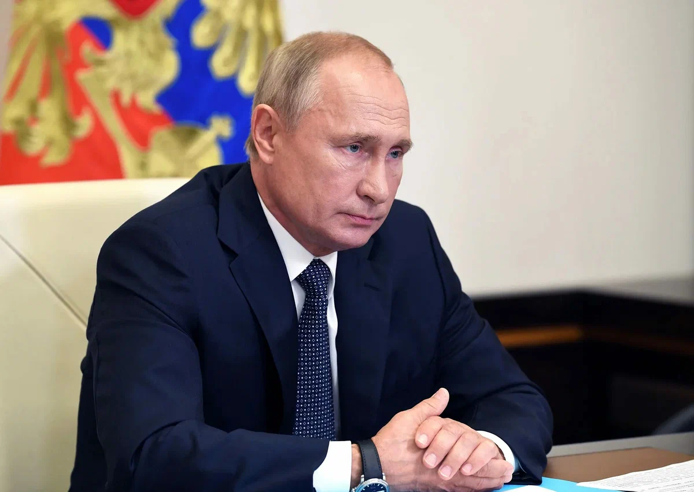

# САЙТ ВАСИЛЬЕВА ВАЛЕРИЯ

 
  Владимир Владимирович Путин — российский государственный и политический деятель.

Родился 7 октября 1952 года в Ленинграде. В 1975 году окончил юридический факультет Ленинградского государственного университета. До 1990 года проходил службу в органах государственной безопасности. Работал помощником проректора ЛГУ, советником председателя Ленинградского городского Совета.
   

   

  

1. В детстве мечтал стать разведчиком. И стал агентом КГБ в 1975 году.
2. Путин вырос в коммунальной квартире на три семьи в Ленинграде. Говорит, что помнит громадных крыс, которые охотились в подъезде.
3. Дед российского президента работал шеф-поваром у Ленина в загородном доме.  Несколько раз ему довелось готовить Сталину. 
4. В школе у него были тройки по химии, физике, алгебре и геометрии.
5. Является автором книги "Учимся дзюдо с Владимиром Путиным", вышедшей еще в 90-е годы. 
6. Коллекционирует географические карты и почтовые марки с изображениями выдающихся людей. 
7. Брак Владимира и Людмилы Путиной распался в 2013 году.
8. Тщательно скрывает дочерей. О них до сих пор мало что известно. Катя и Маша учились в колледжах под вымышленными именами, их профессии и место проживания неизвестны.
9. О Путине снято 12 документальных фильмов: "Неизвестный Путин", "Товарищ президента", "Система Путина", "55", "Стена", "Путин, Россия, Запад", "Мост над бездной", "Dans la peau de Vladimir Poutine" ("В коже Владимира Путина"), "Настоящий Путин", "Бумажная коронация", "Поцелуй Путина", "Я, Путин. Портрет".
10. Президент Владимир Путин – персонаж ряда российских художественных фильмов ("Рассказы", "Гоп-стоп", "Поцелуй не для прессы", "Zомби каникулы 3D", "Кухня в Париже" и др.)
11. Мультипликационный Владимир Путин появляется в мультсериалах "Южный парк", "Гриффины", а также в некоторых видеоклипах.  
12. В сентябре 2012 года Путин совершил полет со стерхами – в рамках проекта "Полет надежды", посвященный спасению этого редкого вида журавлей. Президент возглавил стаю из пяти птиц.
13. Работая с Анатолием Собчаком, Путин носил одновременно малиновый пиджак и спортивные штаны фирмы "Адидас".

